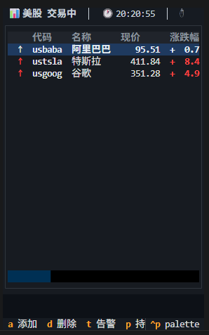

# Stock Watcher · 股票监控

> Real-time stock monitor in the terminal — A-shares, HK, and US markets.
> 终端里的实时股票行情看板 — 支持 A 股、港股、美股。

<div align="center">

**[English](#english)** &nbsp;|&nbsp; **[中文](#中文)**

</div>



---

<h2 id="english">🇬🇧 English</h2>

## Features

- **Multi-market** — Shanghai (`sh`), Shenzhen (`sz`), Hong Kong (`hk`), and US (`us`) stocks
- **Live polling** — auto-refreshes during trading hours, pauses when markets close
- **Sortable table** — click column headers to sort by price, change%, P&L, and more
- **Price alerts** — configurable thresholds (price above/below, change% above/below) with bell + system notification
- **Position tracking** — record cost, quantity, and see unrealized P&L per stock
- **Detail panel** — bid/ask order book (A-shares), PE ratio (HK), recent alert history
- **Feishu push** (optional) — alert cards and periodic summaries to a Feishu/Lark group
- **AI chat** (optional) — DeepSeek-powered `@bot` replies inside Feishu groups
- **Privacy mode** — one-key disguise: all stock names and numbers hidden
- **CSV export** — dump the current table to a timestamped `.csv` file
- **Hot reload** — edit `config.yaml` or `positions.yaml` without restarting

## Prerequisites

- **Python** ≥ 3.11
- **pip** (or your favourite package manager)

## Quick Start

```bash
# Clone
git clone https://github.com/KrisMurdock/job_time_stock_watcher.git
cd job_time_stock_watcher

# Install dependencies
pip install -e .

# Copy example config files
cp config.yaml.example config.yaml
cp positions.yaml.example positions.yaml

# Edit watchlist
# Open config.yaml and replace the stock codes with your own

# Run
python -m stock_watcher.app
```

Or use the convenience script:

```bash
./run.sh
```

## Configuration

All settings live in `config.yaml`. A documented example is at [`config.yaml.example`](config.yaml.example).

### Core settings

| Field | Type | Default | Description |
|-------|------|---------|-------------|
| `poll_interval` | float | `2.5` | Seconds between each stock fetch |
| `watchlist` | list | *example* | Stock codes with market prefixes |
| `alerts` | list | `[]` | Alert rules (see below) |
| `proxies` | list | `[]` | HTTP proxy URLs (e.g. `http://127.0.0.1:7890`) |

### Request tuning

| Field | Type | Default | Description |
|-------|------|---------|-------------|
| `request.timeout` | int | `10` | HTTP timeout (seconds) |
| `request.user_agent_pool` | list | *browsers* | UA strings, one picked per request |

### Backoff (exponential retry)

| Field | Type | Default | Description |
|-------|------|---------|-------------|
| `backoff.base` | float | `5` | Initial delay (seconds) |
| `backoff.max` | float | `120` | Maximum delay |
| `backoff.multiplier` | float | `2` | Exponent factor per failure |

### Alert sound

| Field | Type | Default | Description |
|-------|------|---------|-------------|
| `alert_sound_command` | string | `""` | Shell command for custom audio (Linux: `paplay`, macOS: `afplay`) |

### Stock codes

Prefixes map to markets:

| Prefix | Market | Example |
|--------|--------|---------|
| `sh` | Shanghai A-share | `sh600519` (Kweichow Moutai) |
| `sz` | Shenzhen A-share | `sz000001` (Ping An Bank) |
| `hk` | Hong Kong | `hk00700` (Tencent) |
| `us` | US | `ustsla` (Tesla), `usaapl` (Apple) |

### Alerts

Alert rules live under the `alerts` key. Each rule has three fields:

```yaml
alerts:
  - code: hk00700        # stock code
    type: price_above    # price_above | price_below | pct_above | pct_below
    value: 433.0         # threshold (yuan for price, number for %)
```

### Positions

Positions are stored in a separate file — `positions.yaml`. Copy the example:

```bash
cp positions.yaml.example positions.yaml
```

Format:

```yaml
hk00700:
  cost: 430.0       # buy-in average cost (yuan)
  quantity: 100     # total shares held
  available: 100    # tradable shares
```

Hot-reloaded — no restart needed.

## Usage

### Key bindings

| Key | Action |
|-----|--------|
| `a` | **Add stock** — enter code or name to search |
| `d` | **Delete stock** — remove the highlighted row |
| `t` | **Set alert** — `pa 450` (price above), `pb 420` (price below), `ca 5` (change% above), `cb 3` (change% below) |
| `v` | **View alerts** — list all alert rules, press `d` to delete one |
| `h` | **Alert history** — last 200 fired alerts |
| `p` | **Set position** — `420 200` (cost 420 yuan, 200 shares). Empty to delete. |
| `s` | **Settings** — show current config |
| `e` | **Export CSV** |
| `r` | **Manual refresh** — force-refresh all stocks |
| `x` | **Privacy mode** — hide all stock names and numbers |
| `Enter` | **Detail popup** — full info for highlighted stock |
| `Ctrl+N` | **Reload config** — hot-reload `config.yaml` and `positions.yaml` |
| `Esc` | **Close / cancel** — dismiss any popup or prompt |
| `Click header` | **Sort** — click column header to sort (asc → desc → unsort) |
| `q` | **Quit** |

### Status bar (top)

Shows market status (trading / closed), clock, fetch latency, stock counts (↑ / ↓ / →), and error/backoff state.

### Portfolio bar (bottom)

Shows total positions, total market value, and total unrealized P&L (amount + %), green for profit, red for loss.

## Integrations (optional)

### Feishu / Lark bot

1. In your Feishu group, add a **custom bot** (webhook)
2. Copy the webhook URL into `config.yaml`:
   ```yaml
   chat:
     feishu_webhook: "https://open.feishu.cn/open-apis/bot/v2/hook/YOUR-WEBHOOK"
   ```
3. The bot will send alert cards and periodic market summaries

For bidirectional `@bot` chat, you also need a Feishu app with WebSocket enabled:

```yaml
chat:
  feishu_app_id: "YOUR-APP-ID"
  feishu_app_secret: "YOUR-APP-SECRET"
```

### DeepSeek AI

When Feishu bidirectional bot is enabled, `@bot` mentions are answered by DeepSeek:

```yaml
deepseek:
  api_key: "YOUR-API-KEY"   # get from https://platform.deepseek.com/api_keys
  model: "deepseek-chat"
```

## Project Layout

```
.
├── config.yaml.example      # annotated config template
├── positions.yaml.example   # position data template
├── run.sh                   # convenience launch script
├── pyproject.toml           # project metadata and dependencies
├── docs/
│   ├── image.png            # TUI screenshot
│   └── adr/                 # architecture decision records
├── src/stock_watcher/
│   ├── app.py               # TUI application (entry point)
│   ├── config.py            # config loading, hot-reload, persistence
│   ├── fetcher.py           # market data API clients (Sina, Tencent)
│   ├── models.py            # data models (Quote, Alert, Position, etc.)
│   ├── chat_sender.py       # Feishu webhook card sender
│   ├── bot_server.py        # Feishu WebSocket bidirectional bot
│   └── deepseek_chat.py     # DeepSeek AI integration
└── tests/
    ├── test_app.py          # TUI integration tests
    ├── test_config.py       # config parsing and persistence tests
    ├── test_fetcher.py      # API fetcher tests
    ├── test_models.py       # model unit tests
    └── test_scheduler.py    # polling and backoff tests
```

## License

MIT

---

<h2 id="中文">🇨🇳 中文</h2>

## 功能特性

- **多市场** — 上海A股 (`sh`)、深圳A股 (`sz`)、港股 (`hk`)、美股 (`us`)
- **实时轮询** — 交易时段自动刷新，休市自动暂停节省带宽
- **表头排序** — 点击表头按现价、涨跌幅、盈亏等排序
- **价格告警** — 可配置的阈值（上破/下破价格、涨跌幅），触发时响铃 + 系统通知
- **持仓管理** — 记录成本价、股数，实时显示浮动盈亏
- **详情弹窗** — 五档买卖盘口（A股）、市盈率（港股）、近期告警记录
- **飞书推送**（可选）— 告警卡片 + 定时行情摘要推送到飞书群
- **AI 对话**（可选）— 接入 DeepSeek，在飞书群内 @机器人 智能回复
- **隐私模式** — 一键伪装：所有股票名和数字隐藏，防止屏幕被窥
- **CSV 导出** — 当前表格一键导出到带时间戳的 `.csv` 文件
- **热加载** — 修改 `config.yaml` 或 `positions.yaml` 无需重启

## 环境要求

- **Python** ≥ 3.11
- **pip**（或你习惯的包管理器）

## 快速开始

```bash
# 克隆仓库
git clone https://github.com/KrisMurdock/job_time_stock_watcher.git
cd job_time_stock_watcher

# 安装依赖
pip install -e .

# 复制示例配置文件
cp config.yaml.example config.yaml
cp positions.yaml.example positions.yaml

# 编辑自选股
# 打开 config.yaml，把 watchlist 里的代码换成你自己的

# 运行
python -m stock_watcher.app
```

或者用便捷脚本：

```bash
./run.sh
```

## 配置说明

所有配置在 `config.yaml` 中。带注释的示例文件见 [`config.yaml.example`](config.yaml.example)。

### 核心配置

| 字段 | 类型 | 默认值 | 说明 |
|-------|------|---------|------|
| `poll_interval` | float | `2.5` | 轮询间隔（秒），控制每隔多少秒拉取一只股票的行情 |
| `watchlist` | list | *示例* | 自选股列表，股票代码带市场前缀 |
| `alerts` | list | `[]` | 告警规则（见下方） |
| `proxies` | list | `[]` | HTTP 代理地址，留空表示直连 |

### 请求配置

| 字段 | 类型 | 默认值 | 说明 |
|-------|------|---------|------|
| `request.timeout` | int | `10` | HTTP 请求超时（秒） |
| `request.user_agent_pool` | list | *浏览器* | User-Agent 池，每次请求随机选一个 |

### 退避策略（指数退避）

| 字段 | 类型 | 默认值 | 说明 |
|-------|------|---------|------|
| `backoff.base` | float | `5` | 初始退避秒数 |
| `backoff.max` | float | `120` | 最大退避秒数（天花板） |
| `backoff.multiplier` | float | `2` | 每次失败的乘数 |

### 告警声音

| 字段 | 类型 | 默认值 | 说明 |
|-------|------|---------|------|
| `alert_sound_command` | string | `""` | 自定义音效 shell 命令（Linux: `paplay`，macOS: `afplay`） |

### 股票代码前缀

| 前缀 | 市场 | 示例 |
|--------|--------|---------|
| `sh` | 上海A股 | `sh600519`（贵州茅台） |
| `sz` | 深圳A股 | `sz000001`（平安银行） |
| `hk` | 港股 | `hk00700`（腾讯控股） |
| `us` | 美股 | `ustsla`（特斯拉）、`usaapl`（苹果） |

### 告警规则

告警规则放在 `alerts` 下，每条包含三个字段：

```yaml
alerts:
  - code: hk00700        # 股票代码
    type: price_above    # price_above（上破）/ price_below（下破）/ pct_above（涨幅超）/ pct_below（跌幅超）
    value: 433.0         # 阈值（价格用元，百分比用数字，如 5.0 表示 5%）
```

### 持仓信息

持仓数据单独存放在 `positions.yaml`。先复制示例：

```bash
cp positions.yaml.example positions.yaml
```

格式：

```yaml
hk00700:
  cost: 430.0       # 买入成本价（元）
  quantity: 100     # 持仓股数
  available: 100    # 可用股数
```

支持热加载 — 修改后无需重启。

## 使用说明

### 快捷键

| 按键 | 功能 |
|-----|--------|
| `a` | **添加股票** — 输入代码或名称搜索 |
| `d` | **删除股票** — 删除当前高亮的行 |
| `t` | **设置告警** — 格式：`pa 450`（价格上破450）、`pb 420`（价格下破420）、`ca 5`（涨幅超5%）、`cb 3`（跌幅超3%） |
| `v` | **查看告警** — 列出所有告警规则，选中后按 `d` 删除 |
| `h` | **告警历史** — 查看最近 200 条触发记录 |
| `p` | **设置持仓** — 格式：`420 200`（成本420元、200股），留空删除持仓 |
| `s` | **查看配置** — 显示当前配置参数 |
| `e` | **导出 CSV** |
| `r` | **手动刷新** — 强制立即刷新所有股票 |
| `x` | **隐私模式** — 一键隐藏所有股票名称和数字 |
| `Enter` | **详情弹窗** — 当前高亮股票的完整信息 |
| `Ctrl+N` | **重新加载配置** — 热加载 config.yaml 和 positions.yaml |
| `Esc` | **关闭/取消** — 关闭弹窗或取消输入 |
| `点击表头` | **排序** — 点击表头排序（升序 → 降序 → 取消排序） |
| `q` | **退出** |

### 顶部状态栏

显示市场状态（交易中/休市）、当前时间、抓取延迟、涨跌平统计数、错误和退避状态。

### 底部持仓栏

显示持仓数、总市值、总浮动盈亏（金额+百分比），盈利绿色、亏损红色。

## 可选集成

### 飞书/Lark 机器人

1. 在飞书群设置中添加**自定义机器人**（webhook）
2. 将 webhook 地址填入 `config.yaml`：
   ```yaml
   chat:
     feishu_webhook: "https://open.feishu.cn/open-apis/bot/v2/hook/你的webhook地址"
   ```
3. 机器人将自动推送告警卡片和定时行情摘要

如需双向 `@机器人` 对话，还需在飞书开放平台创建企业自建应用并开启 WebSocket：

```yaml
chat:
  feishu_app_id: "你的APP-ID"
  feishu_app_secret: "你的APP-SECRET"
```

### DeepSeek AI 对话

启用飞书双向机器人后，群内 @机器人 的问题将由 DeepSeek 回答：

```yaml
deepseek:
  api_key: "你的API-KEY"   # 在 https://platform.deepseek.com/api_keys 获取
  model: "deepseek-chat"
```

## 项目结构

```
.
├── config.yaml.example      # 带注释的配置模板
├── positions.yaml.example   # 持仓数据模板
├── run.sh                   # 便捷启动脚本
├── pyproject.toml           # 项目元数据和依赖声明
├── docs/
│   ├── image.png            # TUI 截图
│   └── adr/                 # 架构决策记录
├── src/stock_watcher/
│   ├── app.py               # TUI 应用（入口）
│   ├── config.py            # 配置加载、热加载、持久化
│   ├── fetcher.py           # 行情数据接口（新浪、腾讯）
│   ├── models.py            # 数据模型（Quote、Alert、Position 等）
│   ├── chat_sender.py       # 飞书 webhook 卡片发送
│   ├── bot_server.py        # 飞书 WebSocket 双向机器人
│   └── deepseek_chat.py     # DeepSeek AI 集成
└── tests/
    ├── test_app.py          # TUI 集成测试
    ├── test_config.py       # 配置解析和持久化测试
    ├── test_fetcher.py      # API 抓取测试
    ├── test_models.py       # 模型单元测试
    └── test_scheduler.py    # 轮询和退避测试
```

## 许可证

MIT
